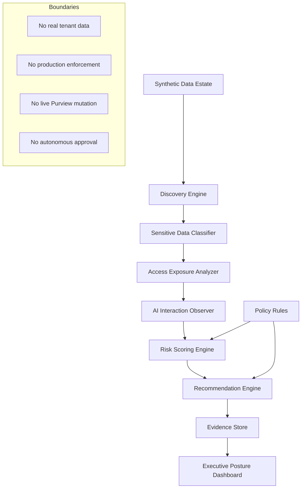

# SecureTheCloud DSPM AI Governance Lab

> Data Security Posture Management for GenAI, Copilot-style assistants, agents, sensitive data exposure, and audit-ready governance evidence.


---

## Mission

This lab models how an enterprise security team can use a DSPM-style workflow to answer one critical question before enabling GenAI, Copilot-style tools, or autonomous agents:

> **Is our sensitive data estate ready for AI access?**

The lab demonstrates a data-centric security posture workflow:

1. Discover sensitive data assets.
2. Classify data by sensitivity and business context.
3. Analyze oversharing, external exposure, and missing controls.
4. Observe AI app and agent interactions with sensitive data.
5. Score posture risk.
6. Generate DLP, Insider Risk, access-review, and AI-governance recommendations.
7. Produce evidence records suitable for audit, review, and executive reporting.

---

## Core Doctrine

This repository follows the SecureTheCloud governance-first pattern:

```text
AI can assist, classify, summarize, recommend, and explain.
AI cannot approve, authorize, override, exfiltrate, mutate policy, or bypass human governance.
```

DSPM in this lab is treated as a **risk intelligence and posture evidence layer**, not as a production enforcement system.

---

## Architecture



---

## Lab Outcomes

By the end of the lab, this repository should demonstrate:

| Capability | Outcome |
|---|---|
| Data discovery | Inventory of synthetic sensitive assets across SharePoint-like, Blob-like, GitHub-like, and AI-interaction sources |
| Classification | PII, PHI, PCI, payroll, legal, credentials, confidential business data |
| Access exposure | Detection of broad access, external sharing, and privileged overexposure |
| AI observability | Visibility into Copilot-style and agent-style interactions with sensitive data |
| Risk scoring | Repeatable posture scoring across sensitivity, exposure, AI access, and missing controls |
| Recommendations | DLP, Insider Risk, access review, labeling, approval, and redaction recommendations |
| Evidence | Machine-readable audit records for governance review and executive reporting |

---

## Repository Layout

```text
.
├── README.md
├── AGENTS.md
├── GOVERNANCE.md
├── Makefile
├── docker-compose.yml
├── .github/
│   ├── pull_request_template.md
│   └── workflows/
│       └── validation.yml
├── backend/
│   ├── requirements.txt
│   ├── app/
│   │   ├── __init__.py
│   │   ├── main.py
│   │   ├── models.py
│   │   └── scoring.py
│   └── tests/
│       └── test_scoring.py
├── data/
│   ├── assets/
│   │   └── sample_assets.json
│   └── events/
│       └── ai_interactions.json
├── docs/
│   ├── architecture/
│   │   ├── DSPM_AI_GOVERNANCE_ARCHITECTURE.md
│   │   ├── POLICY_RECOMMENDATION_MODEL.md
│   │   └── RISK_MODEL.md
│   ├── phases/
│   │   ├── PHASE_0_REPOSITORY_BOOTSTRAP_SOURCE_OF_TRUTH_BASELINE.md
│   │   └── PHASE_TRACKER.md
│   ├── scenarios/
│   │   └── SCENARIO_001_COPILOT_SENSITIVE_DATA_OVERSHARING.md
│   └── sot/
│       ├── ARCHITECTURE_BASELINE.md
│       ├── GOVERNANCE_BOUNDARIES.md
│       └── PROJECT_SOURCE_OF_TRUTH.md
├── evidence/
│   └── README.md
├── frontend/
│   └── README.md
├── policies/
│   └── dspm_policy_rules.yaml
└── scripts/
    └── validate_repo.py
```

---

## Quick Start

```bash
git clone https://github.com/S3curethecloud/securethecloud-dspm-ai-governance-lab.git
cd securethecloud-dspm-ai-governance-lab
python -m venv .venv
source .venv/bin/activate
pip install -r backend/requirements.txt
pytest backend/tests
python scripts/validate_repo.py
```

Run the local API:

```bash
uvicorn backend.app.main:app --reload --port 8015
```

Then open:

```text
http://127.0.0.1:8015/health
http://127.0.0.1:8015/posture/summary
```

---

## Phase Roadmap

| Phase | Name | Status |
|---|---|---|
| 0 | Repository bootstrap and SoT baseline | Complete |
| 1 | DSPM conceptual architecture and risk model | In progress |
| 2 | Synthetic data estate and classifier | Planned |
| 3 | Access exposure analyzer | Planned |
| 4 | AI interaction observability | Planned |
| 5 | Risk scoring and recommendation engine | Planned |
| 6 | Evidence package and audit chain | Planned |
| 7 | Executive posture dashboard | Planned |
| 8 | Microsoft Purview / Copilot mapping guide | Planned |
| 9 | CI validation and release evidence | Planned |

---

## Current Safety Boundary

This lab currently uses **synthetic data only**. It does not connect to Microsoft 365, Microsoft Purview, Microsoft Graph, Azure, customer tenants, production systems, or real user data.

The purpose is to demonstrate enterprise-grade architecture, security reasoning, posture scoring, recommendation logic, and evidence discipline before any future live connector work.
