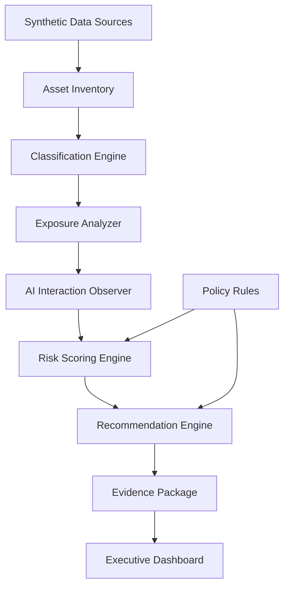

# DSPM AI Governance Architecture

## Executive Summary

This lab implements a synthetic Data Security Posture Management architecture for AI adoption readiness. It focuses on sensitive data risk before and during AI use.

Traditional security posture often starts with infrastructure, identity, or network controls. DSPM starts with the data:

- What sensitive data exists?
- Where does it live?
- Who can access it?
- Is it overshared?
- Is AI interacting with it?
- Are DLP, Insider Risk, and approval controls mapped to the exposure?
- Is there evidence for review and audit?

## Logical Architecture

## Data Sources

The lab starts with synthetic sources that represent common enterprise surfaces:

- SharePoint-like collaboration files
- OneDrive-like user files
- Blob-like customer data exports
- GitHub-like prompt and runbook repositories
- Copilot-style and agent-style AI interaction events

## Risk Dimensions

| Dimension | Example |
|---|---|
| Sensitivity | confidential, highly confidential, regulated |
| Data type | PII, PHI, PCI, payroll, legal, financial, credentials |
| Access scope | all employees, domain users, external sharing |
| AI exposure | AI retrieval or summarization allowed |
| Control coverage | missing DLP or Insider Risk policy |
| Destination | internal or risky external destination |

## Decision Outcomes

| Decision | Meaning |
|---|---|
| allow | No material risk detected; continue monitoring |
| redact | Allow only after sensitive elements are removed or masked |
| approval_required | Human/data owner review required before action |
| deny | Block or treat as blocked in simulation until remediation evidence exists |

## Why This Matters For GenAI

GenAI and Copilot-style tools can amplify existing data posture weaknesses. If sensitive files are overshared, unlabeled, externally exposed, or missing DLP coverage, AI systems may retrieve or summarize data beyond the intended audience.

This lab demonstrates how to identify and explain those risks before expanding AI adoption.
